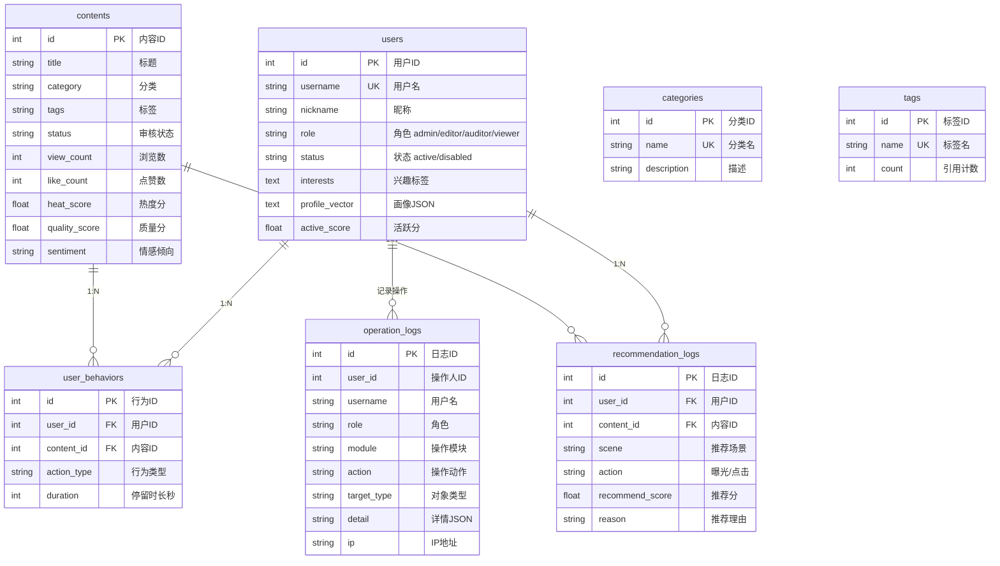

# 数据库 ER 图

## 关系说明

| 关系 | 源表 | 目标表 | 类型 | 说明 |
|------|------|--------|------|------|
| 用户→行为 | users | user_behaviors | 1:N | 一个用户可产生多条行为记录 |
| 内容→行为 | contents | user_behaviors | 1:N | 一个内容可被多个用户操作 |
| 用户→推荐日志 | users | recommendation_logs | 1:N | 一个用户可接收多次推荐 |
| 内容→推荐日志 | contents | recommendation_logs | 1:N | 一个内容可被多次推荐 |
| 用户→操作日志 | users | operation_logs | 记录操作 | 非外键关联，仅记录 user_id/username |

## 核心关系解读

### 行为记录（user_behaviors）— 桥梁表

`user_behaviors` 是整个系统最核心的桥梁表，连接 `users` 和 `contents`：

- **写入时**：每次用户操作（浏览/点赞/收藏/评论/分享/不感兴趣）都写入一条记录
- **触发联动**：写入后同步更新 `contents` 的互动计数和 `users` 的画像数据
- **推荐依据**：推荐引擎读取 `user_behaviors` 构建用户兴趣标签权重

### 推荐日志（recommendation_logs）— 效果度量表

记录每次推荐暴露和用户点击，支撑 CTR 分析：

- `action=exposure` → 记录推荐曝光
- `action=click` → 用户点击推荐内容
- CTR = count(click) / count(exposure) × 100%

### 操作日志（operation_logs）— 审计追溯表

独立记录管理员/编辑的关键后台操作，与业务表非外键关联：

- 即使目标数据被删除，日志记录仍保留
- 冗余存储 username/role，避免 JOIN 查询
